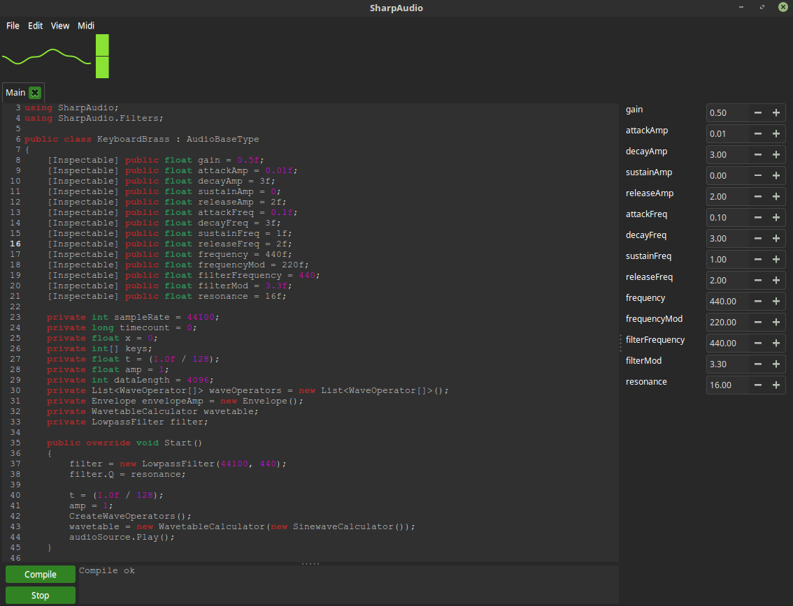

# SharpAudio
Realtime audio processing IDE using C# and the DotNetCore runtime.

# Dependencies
- DotNetCore Runtime and SDK https://dotnet.microsoft.com/download/dotnet-core/3.1
- libgtk-3-dev
- glib 2.0
- libgtksourceview-3.0-dev
- libLinuxForms https://github.com/japajoe/LinuxForms
- libByteMe https://github.com/japajoe/ByteMe
- libasound
- libsdl2-dev

# Disclaimer
All the information provided on this repository is provided on an “as is” and “as available” basis and you agree that you use such information entirely at your own risk.

The author gives no warranty and accepts no responsibility or liability for the accuracy or the completeness of the information and materials contained in this repository. Under no circumstances will the author be held responsible or liable in any way for any claims, damages, losses, expenses, costs or liabilities whatsoever (including, without limitation, any direct or indirect damages for loss of profits, business interruption or loss of information) resulting or arising directly or indirectly from your use of or inability to use this repository or any websites linked to it, or from your reliance on the information and material on this repository, even if the author has been advised of the possibility of such damages in advance.
